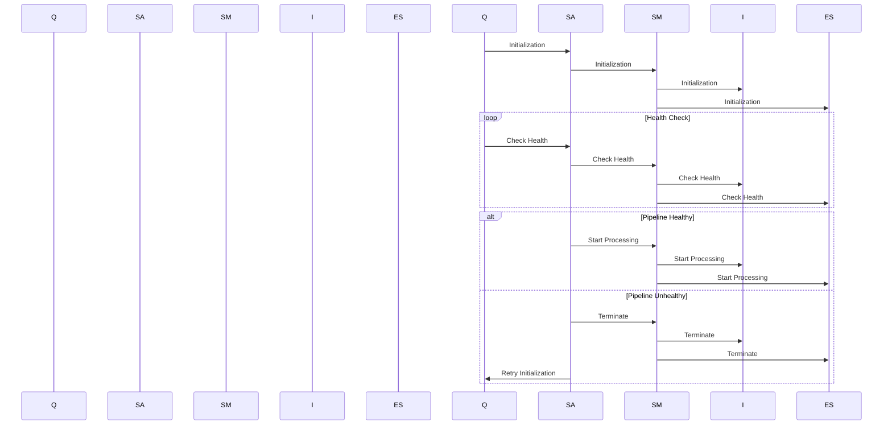

# Querent

Querent is an enterprise-grade Rust engine built on top of Querent, designed to provide powerful and flexible querying capabilities for various data sources. It leverages the Querent library to facilitate efficient and expressive searches across structured and unstructured data.

## Features

- **Semantic Querying:** Querent enables semantic querying by utilizing a SemanticPayload data structure. This allows users to express complex queries based on semantic relationships between entities.

- **Support for Multiple Index Databases:** Querent is designed to support various index databases, including Milvus and Neo4j. This flexibility allows users to choose the indexing solution that best fits their requirements.

- **Modular Architecture:** The architecture of Querent is modular, making it easy to extend and integrate with different components. This modularity promotes scalability and maintainability.

- **Indexing Actor:** Querent includes an indexing actor responsible for efficiently processing and indexing SemanticPayload data. The actor model ensures concurrent and asynchronous handling of indexing tasks.

- **Detailed Indexing Metrics:** The indexing actor tracks various metrics during the indexing process, such as the number of documents indexed, memory usage, indexing throughput, and more. These metrics provide insights into the performance and health of the indexing process.

- **Querying Capabilities:** Querent supports expressive querying capabilities, allowing users to perform complex searches based on semantic relationships, predicates, and other criteria.

- **Resource Utilization Monitoring:** The engine monitors resource utilization during both indexing and querying, helping users optimize performance and allocate resources effectively.

## Sequence Diagram

## Architecture

## Contributing

We welcome contributions to Querent! If you have ideas, bug reports, or feature requests, please [open an issue](https://github.com/querent-ai/querent/issues) or submit a pull request.

## License

Querent is licensed under the [BSL License](LICENSE).
